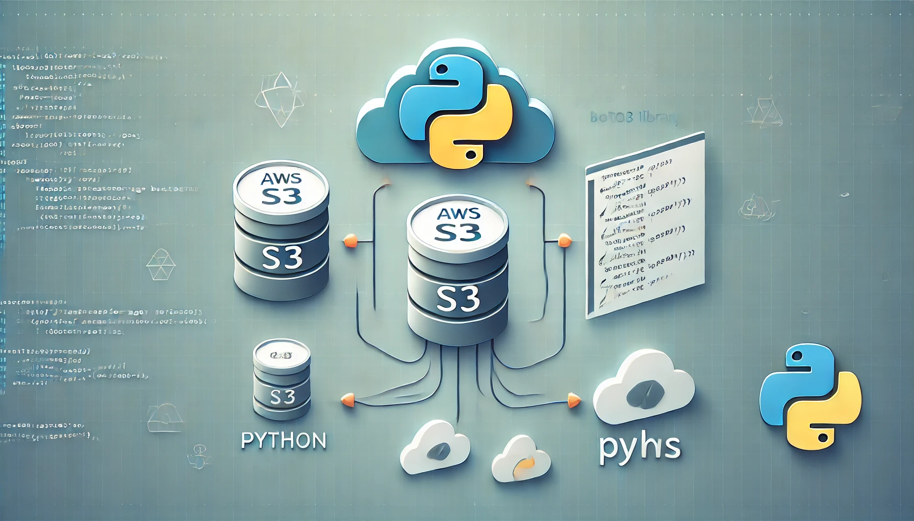
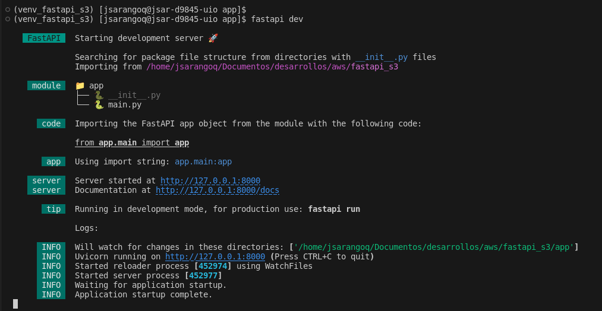
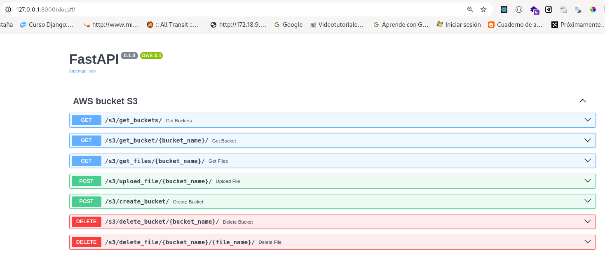

# Boto3 S3 API FastAPI


## Requisitos

- Python 3.11 o superior
- FastAPI
- Boto3

## Instalación

```bash
git clone https://github.com/juliosarango/fastapi-s3.git
cd fastapi-s3
python -m venv venv_fastapi_s3
source venv_fastapi_s3/bin/activate
pip install -r requirements.txt
```

## Ejecución

```bash
cd app
fastapi dev
```


## API
Navegar a la ruta `http://localhost:8000/docs` para ver la API


## Configuración en AWS 
Para seguir la configuración de políticas en IAM de AWS, siga los pasos indicados en el [siguiente post](https://)
